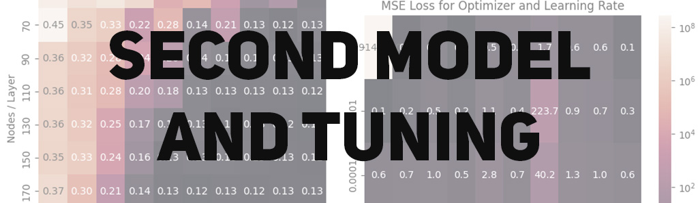
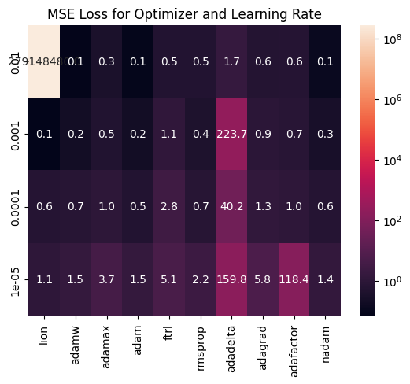
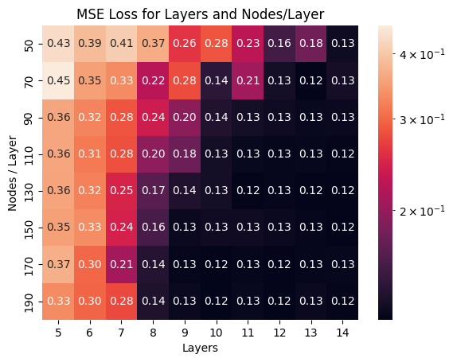

# Predicting AirBnB Review Scores

Names:
- Artur Rodrigues, arodrigues (at) ucsd (dot) edu 
- Doanh Nguyen, don012 (at) ucsd (dot) edu 
- Ryan Batubara, rbatubara (at) ucsd (dot) edu

**NOTE:** This readme is also available as a website [here](https://doanhandonly.github.io/RAD-CSE151A-Project/)!

**Our written report can be found in [Report.md](Report.md), or as a website [here](https://doanhandonly.github.io/RAD-CSE151A-Project/Report.html)!**

## Table of Contents
- [Predicting AirBnB Review Scores](#predicting-airbnb-review-scores)
  - [Table of Contents](#table-of-contents)
  - [Abstract](#abstract)
  - [Dataset](#dataset)
  - [Data Preprocessing](#data-preprocessing)
    - [Dropping Unecessary Columns](#dropping-unecessary-columns)
    - [Dropping 0 Review Listings](#dropping-0-review-listings)
    - [Fixing Datatypes](#fixing-datatypes)
  - [Exploratory Data Analysis](#exploratory-data-analysis)
    - [Geographical Data](#geographical-data)
  - [First Model](#first-model)
    - [Choosing a First Model](#choosing-a-first-model)
    - [First Model Evaluation](#first-model-evaluation)
    - [First Model on Fitting Graph](#first-model-on-fitting-graph)
    - [Model Improvements](#model-improvements)
    - [Conclusion and Next Model](#conclusion-and-next-model)
  - [Second Model](#second-model)
    - [Choosing a Second Model](#choosing-a-second-model)
    - [Hyperparamter Tuning](#hyperparamter-tuning)
    - [Model Evaluation](#model-evaluation)
    - [Model on Fitting Graph](#model-on-fitting-graph)
    - [Model Improvements](#model-improvements-1)
    - [Conclusion and Next Model](#conclusion-and-next-model-1)
  - [Conclusion](#conclusion)


## Abstract
[Back to table of contents](#table-of-contents)

With the end of the Covid 19 pandemic, there has been a huge boom in travel and entertainment industries worldwide. With the pandemic still in the minds of many people, travelers may tend to seek more private and personal accommodations such as those on AirBnB. Here, we predict the review score (on a scale of 0 to 5) of an AirBnB posting based on various features, like amenities available, number of reviews, price, and others. The intention is that this may provide AirBnB hosts better insight into what makes a highly rated AirBnB experience, by creating a model that helps predict a given listing's review rating.

## Dataset
[Back to table of contents](#table-of-contents)

This project will be based on data gathered by [Inside AirBnb](https://insideairbnb.com/get-the-data/) May to June 2024. To keep our analysis more focused, we will only be analyzing AirBnB listings from the United States. Since Inside AirBnB only offers datasets per city, we have downloaded all US cities with AirBnB listings and combined them into one csv file. Due to the size of this file, [Inside AirBnB reposting policies](https://insideairbnb.com/data-policies/), and [Github Data storage policies](https://docs.github.com/en/repositories/working-with-files/managing-large-files/about-storage-and-bandwidth-usage), we will not be uploading this combined file to the repository. That said, the combined dataset is available [here](https://drive.google.com/file/d/1DwNaHBBgTesytLoGn23QZMURfK41Du2K/view?usp=sharing), but requires a UCSD account.

A data dictionary for the data can be found at [Inside AirBnB's data dictionary](https://docs.google.com/spreadsheets/d/1iWCNJcSutYqpULSQHlNyGInUvHg2BoUGoNRIGa6Szc4/edit?gid=1322284596#gid=1322284596).


## Data Preprocessing
[Back to table of contents](#table-of-contents)

Our data preprocessing can be split into three steps:

### Dropping Unecessary Columns
[Back to table of contents](#table-of-contents)

Some columns in the original data are unecessary for our purposes. For a detailed description of each column, see the [Inside AirBnB Data Dictionary](https://docs.google.com/spreadsheets/d/1iWCNJcSutYqpULSQHlNyGInUvHg2BoUGoNRIGa6Szc4/edit?gid=1322284596#gid=1322284596).

We list reasons for dropping these columns:
- `All URL`: Unique elements for each listing. Does not contribute anything when predicting the review score.

- `All ID`: Unique elements for each listing. Does not contribute anything when predicting the review score.

- `host_name`: Indiviudally unique elements for each listing. Does not contribute anything when predicting the review score.

- `license`: Unique elements for each listing. Does not contribute anything when predicting the review score.

- `source`: Holds whether or not the listing was found via searching by city or if the listing was seen in a previous scrape. There is no logical
connection between this and the target variable, which is review score.

- `host_location`: Private information.

- `host_total_listings_count`: There exists another feature called `host_listings_count`, this is a duplicate feature.

- `calendar_last_scarped`: Holds the date of the last time the data was scrapped, no logical connection between this and predicting `review_score_rating`.

- `first & last review`: provides temporal data for the first & last review date. Last review date can be misleading as an unpopular listing may have no reviews for an extended amount of time, and suddenly get a review.

- `minimum_minimum_nights, maximum_minimum_nights, minimum_maximum_nights, maximum_maximum_nights`: The all time minimum and maximum of a listing's minimum and maximum nights requirement for booking. This has no correlation to review score because you cannot write a review if you have not stayed at the listing. A person who wants to book a listing for 10 days is not going to book a listing that has a maximum night stay of 9 days.

### Dropping 0 Review Listings
[Back to table of contents](#table-of-contents)

Since we are trying to predict AirBnB review scores (for the purpose of finding out what makes a good review score), we will be dropping all listings that have 0 reviews. This is because, from the perspective of our model, these rows do not provide any meaningful information into what makes a highly rated listing (since their review scores are `NaN`, and are missing by design).

We remark that this still leaves us with almost 200 thousand rows, so the data remains large enough for a model.

### Fixing Datatypes
[Back to table of contents](#table-of-contents)

Some columns have incorrect datatypes, such as:
- `host_response_rate` and `host_acceptance_rate` should be change from a `str` percent to a `float`.
- `host_is_superhost`, `host_has_profile_pic`, `host_identity_verified`, `has_availability`, `instant_bookable` should be booleans.
- `last_scraped` and `host_since` should be Pandas timestamps.
- `price` should be a float in dollars.
- `amenities` should be a list.

## Exploratory Data Analysis
[Back to table of contents](#table-of-contents)

This exploratory data analysis will be split into three parts:

- [General Data EDA](#general-data-eda), where we visualize general information about the dataset.
- [Numerical Data EDA](#numerical-data-eda), where we see how numerical features relate to predicting review scores.
- [Text and Categorical Data EDA](#text-and-categorical-eda), where we see how textual and categorical data may help our predictions.

You can see our EDA in the Jupyter notebook called `eda.ipynb` in the `eda` folder [here](./eda/eda.ipynb). However, we attach our key visualizations and a brief description of each below:

### Geographical Data
[Back to table of contents](#table-of-contents)


## First Model

### Choosing a First Model
[Back to table of contents](#table-of-contents)

At this point, we have two groups of features:
- Categorical Columns, encoded into some sort of numerical feature as described in the previous section.
- Numerical Columns, which is essentially every other feature in our dataset.

We plan to put all of these features into a LinearRegression model from sklearn. There are three main reasons a LinearRegression model is ideal for our base model:
1. It is relatively simple, and features almost entirely dictate how well the model performs. This allows us to focus on enginnering good, relevant features for our second, more complicated model.
2. LinearRegression allows us to check the coefficient of every variable, and when standardized or normalized, a sense of which features play the largest role in determining the review score.
3. It is extremely fast and easy to implement LinearRegression, allowing us to test many different features and encodings quickly.

We summarize our preprocessing and features below:

```python
preproc = make_column_transformer(
    (SubstringsTransformer(names_meaningful), 'name'),
    (SubstringsTransformer(desc_meaningful), 'description'),
    (WeekTransformer(), 'host_since'),
    (LengthTransformer(), 'host_verifications'),
    (OneHotEncoder(handle_unknown='ignore'), ['property_type']),
    (OneHotEncoder(handle_unknown='ignore'), ['room_type']),
    (LengthTransformer(), 'amenities'),
    (StandardScaler(), numeric_features)
)
```

The above preprocessor simply applies the given transformer to the columns on the second item in the tuple. As such, all that is left to do is to put this preprocessor into a pipeline alongside our model. Note however, that sklearn cannot support missing values, and so we will conduct mean imputation for these missing values. This is because LinearRegression (based on minimizing mean_square_error) will not get any better nor any worse if a data point with all mean values is added or removed from the dataset.

### First Model Evaluation
[Back to table of contents](#table-of-contents)

We now do 10-fold cross validaton and report the metrics for each fold.

|              |   mean_squared_error |   mean_absolute_error |   r2_score |
|:-------------|---------------------:|----------------------:|-----------:|
| (0, 'train') |             0.12613  |              0.198191 |  0.0879473 |
| (0, 'test')  |             0.130564 |              0.20048  |  0.08552   |
| (1, 'train') |             0.127414 |              0.199016 |  0.0872061 |
| (1, 'test')  |             0.118979 |              0.195752 |  0.0924823 |
| (2, 'train') |             0.126681 |              0.198671 |  0.0875633 |
| (2, 'test')  |             0.125549 |              0.19663  |  0.0893076 |
| (3, 'train') |             0.127029 |              0.198596 |  0.0875516 |
| (3, 'test')  |             0.123754 |              0.197797 |  0.0795305 |
| (4, 'train') |             0.126899 |              0.198766 |  0.0880649 |
| (4, 'test')  |             0.123835 |              0.196832 |  0.0828053 |
| (5, 'train') |             0.12554  |              0.197758 |  0.0881043 |
| (5, 'test')  |             0.135944 |              0.203179 |  0.0836539 |
| (6, 'train') |             0.126947 |              0.198569 |  0.0878757 |
| (6, 'test')  |             0.123132 |              0.198147 |  0.0866351 |
| (7, 'train') |             0.126227 |              0.198311 |  0.0874304 |
| (7, 'test')  |             0.129676 |              0.198832 |  0.0900592 |
| (8, 'train') |             0.126344 |              0.198277 |  0.0879102 |
| (8, 'test')  |             0.128622 |              0.199914 |  0.0859053 |
| (9, 'train') |             0.126359 |              0.198572 |  0.0884995 |
| (9, 'test')  |             0.128394 |              0.198563 |  0.0812679 |

We summarize it by taking the averages below:

|       |   mean_squared_error |   mean_absolute_error |   r2_score |
|:------|---------------------:|----------------------:|-----------:|
| test  |             0.126845 |              0.198613 |  0.0857167 |
| train |             0.126557 |              0.198473 |  0.0878153 |

We will now interpret the above metrics in more detail. We start with the `mean_absolute_error`, which tells us that on average our predicted rating is 0.19 off for both the test and train cases. The similarity between these values tell us that our model has not overfitted, but the large values (considering review ratings go from 0 to 5 only) show us that the model is not very good.

Same can be said for our `mean_squared_error`. We note that its value is smaller than the `mean_absolute_error`, which makes sense as it is roughly the square root of the `mean_absolute_error`.

The `r2_score` however tells a very interesting story. The `r2_score` is a correlation metric that goes from 0 to 1, where 0 implies no correlation and 1 is identical correlation. Our low value of 0.08 tells us that despite the large number of features, we still have not effectively represented the data. This makes sense - it is very hard to even describe in words what would make one AirBnb listing more highly rated than the other. However, this also gives us plenty of room to improve in our second model.

### First Model on Fitting Graph
[Back to table of contents](#table-of-contents)

Based on our relatively high MSE, and generally almost identical test and train MSE, MAE, and r2, it is safe to say that our model is not that far along the fitting graph. In other words, our model has not overfitted the data since we see very similar values between the test and train metrics. This is very good for us, as there is much room to add more model complexity - such as by adding more features, or changing to a more complex model - and improve the metrics in our second, better model.

### Model Improvements
[Back to table of contents](#table-of-contents)

Our results are not ideal, we have a relatively high MSE and MAE, and our r^2 score isn't where we would like it to be. This is unfortunate as we were hoping for better results, however, the good part of this is that firstly, we can be pretty confident that we are not overfitting the data and secondly, we have a lot of room for improvement both for our models, and for our machine learning skills as we this will allow us to further develop/apply the things that we are learning in this class to improve our model.

Here are some ways in which we may be able to improve our model:
- Increasing the number of features
- Better feature engineering
- Trying different complexity models such as polynomial regression or neural networks
- We could try using coalesced features.

### Conclusion and Next Model
[Back to table of contents](#table-of-contents)

Since our mean squared error of our first model being linear regression is not exactly ideal, we decided that the next potential model we can train and test would be a **neural network**. Since the fit of the linear regression line is producing a unoptimal mean squared error, we believe that a simple linear best fitting line is simply not good enough to fit our supposedly complex data. By using a neural network and messing around with the amount of neurons per hidden layer, the amount of hidden layers, and the many activation functions, we add more depth and complexity in hopes of finding the best fit that captures the relationship between our features while in turn producing a fairly accurate prediction.   



## Second Model
[Back to table of contents](#table-of-contents)

### Choosing a Second Model
[Back to table of contents](#table-of-contents)

Our first model has taught us a few things:
- We need to dramatically increase model complexity.
- There is no "magic feature" that is extremely correlated with review scores.
- Many of our features have only a small number of possible numerical values.

As such, a neural network comes to mind for our second model. Here are three reasons why a neural network appears to be the next best step:

1. The data and features are extremely complicated, so simple kernels like linear or polynomial transformations is insufficeint to describe a feature's relationship with the review scores. A NN will help deal with this.
2. We have an incredible number of features (159), and NNs excel at finding general patterns from a large number of features and combining them together (this means we will need a lot of layers with a lot of nodes each).
3. The data is extremely large, meaning that there is much room for our model to explore the data before it overfits. This reduces the high complexity downside of NNs.

Since we are reusing our preprocessing pipeline from the first model (see above), we will not repeat the details here.

### Hyperparamter Tuning
[Back to table of contents](#table-of-contents)

Before evaluating our model, it makes sense to tune its hyperparameters. However, due to the number of options available, and the time necessary to check all posssible combinations, it makes sense to find the best few possibilities for each choice before running a considerably smaller GridSearch.

We start by trying every optimizer and order of magnitude learning rate:



Clearly, `Lion`, `Adam`/`AdamW`, and `Nadam` have the best, smallest, and most consistent losses, so these are what will move on to our hyperparamter tuning stage.

We then try various number of layers and nodes per layer:



Here, we see how our model's training loss decreases as we add more layers adn more nodes. This is consistent with the fitting graph - as we add more layers or nodes, we increase model complexity, and run the risk of overfitting our training data. This means we need to hyperparameter tune in the region between **8-11 layers and 90-130 nodes**, since this is when the loss starts to go down, without it being too high that we run the risk of overfitting.

To summarize, we have the following hyperparamters to tune:
- Optimizer: `AdamW`, `Nadam`, or `Lion`
- Learning Rate: `0.00001` - `0.0001`
- Layers: `8`-`11`
- Nodes/layer: `90-130`
- Activation Function: `relu`,`sigmoid`,`tanh` (for hidden layers)

We define a Keras tuner to do so, and we get the following results:
| Hyperparamter   | Best Value            |
|:----------------|:----------------------|
| num_layers      | 9                     |
| num_nodes       | 110                   |
| activation_func | sigmoid               |
| optimizer_class | lion                  |
| learning_rate   | 5.449514749224714e-05 |

### Model Evaluation
[Back to table of contents](#table-of-contents)

We now do 10-fold cross validation and report the metrics for each fold.
|              |   mean_squared_error |   mean_absolute_error |   r2_score |
|:-------------|---------------------:|----------------------:|-----------:|
| (0, 'train') |            0.100324  |              0.166675 |  0.187977  |
| (0, 'test')  |            0.130965  |              0.177124 |  0.0920074 |
| (1, 'train') |            0.101551  |              0.179577 |  0.196185  |
| (1, 'test')  |            0.101345  |              0.179156 |  0.149704  |
| (2, 'train') |            0.100578  |              0.175928 |  0.200441  |
| (2, 'test')  |            0.107871  |              0.177049 |  0.130703  |
| (3, 'train') |            0.102913  |              0.18821  |  0.192934  |
| (3, 'test')  |            0.100765  |              0.191031 |  0.0704145 |
| (4, 'train') |            0.103356  |              0.182372 |  0.185835  |
| (4, 'test')  |            0.103187  |              0.184251 |  0.092417  |
| (5, 'train') |            0.102092  |              0.182962 |  0.207228  |
| (5, 'test')  |            0.0919273 |              0.18137  |  0.0514895 |
| (6, 'train') |            0.0991111 |              0.170512 |  0.187944  |
| (6, 'test')  |            0.138846  |              0.182306 |  0.119488  |
| (7, 'train') |            0.100006  |              0.174586 |  0.187665  |
| (7, 'test')  |            0.121794  |              0.185548 |  0.177905  |
| (8, 'train') |            0.103255  |              0.172554 |  0.187263  |
| (8, 'test')  |            0.0966669 |              0.172099 |  0.143063  |
| (9, 'train') |            0.0995553 |              0.173294 |  0.204133  |
| (9, 'test')  |            0.122812  |              0.188462 |  0.057875  |

We summarize it by taking the averages below:

|       |   mean_squared_error |   mean_absolute_error |   r2_score |
|:------|---------------------:|----------------------:|-----------:|
| test  |             0.111618 |              0.18184  |   0.108507 |
| train |             0.101274 |              0.176667 |   0.19376  |

We will now interpret the above metrics in more detail. We start with the `mean_absolute_error`, which tells us that on average our predicted rating is about 0.17 off for both the test and train cases. The similarity between these values tell us that our model has not overfitted, and though the values are a noticeable improvement compared to our first model, it is not ideal either. This shows how complex predicting review scores is.

Same can be said for our `mean_squared_error`. We note that its value is smaller than the `mean_absolute_error`, which makes sense as it is roughly the square root of the `mean_absolute_error`.

The `r2_score` however tells a very interesting story. The `r2_score` is a correlation metric that goes from 0 to 1, where 0 implies no correlation and 1 is identical correlation. Our value of 0.19 for train and 0.10 for test shows that our data is right on the edge of the fitting graph, meaning it is right under from overfitting. This is a marked improvement to our linear regression r2 of about 0.8, meaning our second model is a definite improvement.

### Model on Fitting Graph
[Back to table of contents](#table-of-contents)

Based on the similarity of out MSE and MAE, we know that our model has not overfitted the training data. However, the large difference between r2_scores tells us that our model is much father along - or more complex - than our linear regression model on the fitting graph. In other words, adding more layer or complexity may run the risk of overfitting, though we are clearly not there yet. This is very good for us, since it means that our model is quite generalizable (as the 10 folds contain similar values), but also quite difficult as adding large amounts of complexity is likely going to cause us to overfit our data.

### Model Improvements
[Back to table of contents](#table-of-contents)

Compared to our first model, the second model has much higher model complexity, and there is evidence (as discusses in the r2_scores above) that we are approaching the overfitting mark, though we are not there yet. This leaves us at a rather difficult stalemate: We have engineered a lot of features, have a large amount of data, and high model complexity, with optimized hyperparameters and a very small learning rate. This means that any potential model improvements probably needs to involve a major change in how we do our model.

Here are some ways in which we may be able to improve our model:
- Changing the type of NN layers. Right now, we have a "default" NN with backpropagation and only Dense layers with LeakyRelu in between. Perhaps trying different more complicated layers such as convolution or pooling layers may better bring out the correlations in the data.
- Changing the type of activation function dynamically. Mathematically, each activation function is ideal for a very specific type of identification. Perhaps changing activation functions between layers may help bring out the patterns in the data.
- Doing more feature engineering. Some features, such as amenities, are only explored by length. Though it can be argued that there isn't much for us to do here, (since how much does amenities, for example, really impact the reviews of a listing?), it also means we have not tapped into this data's full potential. However, a full NLP stack will be necessary for this, which comes with concerns of overfitting and bias.

### Conclusion and Next Model
[Back to table of contents](#table-of-contents)

As mentioned above, we believe that a complex model is necessary for this complicated data. As such, out of the regression models we learned in this class, Neural Networks is the only choice. However, a third attempt could be done with more complicated layers such as pooling or convolution layers, or with dynamic activation functions etc as descirbed above. Essentially, since the test error is indeed worse than our training error, adding too much complexity is dangerous to overfitting. Thus, a new direction needs to be taken by a similarly complicated model if we wish to improve our metrics.


## Conclusion
[Back to table of contents](#table-of-contents)

In this project, we trained two models: First a linear regression model, which prompted us engineer features for categorical columns, and second a neural network, which gave us the model complexity and the ability to hyperparameter tune, allowing us to improve our metrics. Though our best model (the tuned NN) has an MSE of 0.1, MAE of 0.1, and r2 of 0.2, which is not ideal roughly speaking, this is already quite good in the grand scheme of things. 

In other words, our purpose of providing more information to AirBnB customers for what things to look out for a highly rated (i.e. enjoyable) stay, and AirBnb hosts by what things to work on to deliver better rated experiences (i.e. more profitable listings) has largely been achieved by this model. For the customer, one can take a listing they really like, but say with 0 or very few reviews, and use the model to heuristically predict whether this listing has the characteristics and potential to be a good stay. To the host, one can take a couple new listings and predict roughly whether one will do better than the other in terms of review scores. This may also allow hosts to tune their descriptions, pricing, etc and predict how these things will impact the review rating of their listing.

Thus, we conclude that given our metrics, being able to predict a given listing's review score plus minus 0.1 stars is more than enough precision to provide meaningful insights to both parties, and thus the project is largely a success. We note however, that based on personal experiences, that a 0.1 rating difference can be quite substantial, espeically when so many choices is presented to the customer by AirBnb.