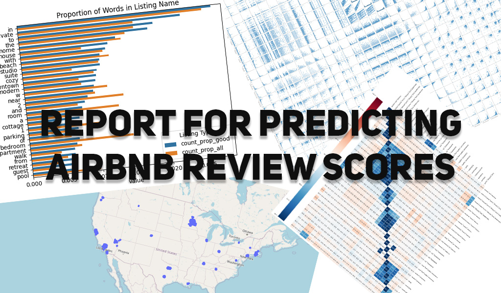

# Predicting AirBnB Review Scores: Report

Names:
- Artur Rodrigues, arodrigues (at) ucsd (dot) edu 
- Doanh Nguyen, don012 (at) ucsd (dot) edu 
- Ryan Batubara, rbatubara (at) ucsd (dot) edu

**NOTE:** This report is also available as a website [here](https://doanhandonly.github.io/RAD-CSE151A-Project/Report.html)

## Table of Contents:
- [Predicting AirBnB Review Scores: Report](#predicting-airbnb-review-scores-report)
  - [Table of Contents:](#table-of-contents)
  - [Introduction](#introduction)
  - [Methods](#methods)
    - [Data Exploration:](#data-exploration)
    - [Preprocessing](#preprocessing)
    - [Model 1](#model-1)
    - [Model 2](#model-2)
  - [Statement of Collaboration](#statement-of-collaboration)

## Introduction

Since the end of COVID-19 quarantine, people flocked out of their houses to be in a place that is not their home after a long, long lockdown. AirBnb is usually the first thing that comes to mind for people seeking a more unique, personalized, and intimate housing experience compared to traditional hotels and motels. As AirBnb users, we wanted to take a deeper look into what makes an AirBnb listing special, why is it that one listing can have a much better review score then another listing? It was cool seeing what kind of features managed to push a listing's review score higher and higher while seeing which features had a negative correlation with the review scores. With this information in mind, we can make a more well-informed decision on our next vacation destination.

When it comes to training a predictive model, it is important that it is well optimized and its predictions are as accurate and precise as possible. As industries, academia, and healthcare slowly start adopting more and more Artificial Intelligence decision making tools, and relying heavily on predictive models, it is imperative that there model's predictions reflect the ground truth.

## Methods 

### Data Exploration:

Initially our dataset was fragmented into different city datasets, we webscraped all the US cities dataset and combined them all in pandas. We then took a look at our features and dropped all features that were private information, had unique elements, such as the listing host_id, and any form of url features. There were oddly enough observations that had 0 review scores so we immediately drop those since if the observation has 0 review scores, then we cannot train or test on this observation since the model would not learn anything if the target variable was empty. We then started to fix some of the datatypes observed in some specific features. For instance, host_response_rate and host_acceptance_rate were of str data type that needed to be changed to a float datatype. After dropping all irrelevant features and fixing up the mismatching data types, we began to plot out our data. We began by plotting the usual correlation heatmap and pairplots. Something we were interested in visualizing was the shape of the histogram when we plotted the host joined by year. Of course, we saw the exponential growth a most companies go through when they first start out, the decline during quarantine, and the resurgence of hosts joining AirBNB once lockdown was over. 

  We list reasons for dropping these columns:
  - `All URL`: Unique elements for each listing. Does not contribute anything when predicting the review score.

  - `All ID`: Unique elements for each listing. Does not contribute anything when predicting the review score.

  - `host_name`: Indiviudally unique elements for each listing. Does not contribute anything when predicting the review score.

  - `license`: Unique elements for each listing. Does not contribute anything when predicting the review score.

  - `source`: Holds whether or not the listing was found via searching by city or if the listing was seen in a previous scrape. There is no logical
connection between this and the target variable, which is review score.

  - `host_location`: Private information.

  - `host_total_listings_count`: There exists another feature called `host_listings_count`, this is a duplicate feature.

  - `calendar_last_scarped`: Holds the date of the last time the data was scrapped, no logical connection between this and predicting `review_score_rating`.

  - `first & last review`: provides temporal data for the first & last review date. Last review date can be misleading as an unpopular listing may have no reviews for an extended amount of time, and suddenly get a review.

  - `minimum_minimum_nights, maximum_minimum_nights, minimum_maximum_nights, maximum_maximum_nights`: The all time minimum and maximum of a listing's minimum and maximum nights requirement for booking. This has no correlation to review score because you cannot write a review if you have not stayed at the listing. A person who wants to book a listing for 10 days is not going to book a listing that has a maximum night stay of 9 days.

  Some columns have incorrect datatypes, such as:
  - `host_response_rate` and `host_acceptance_rate` should be change from a `str` percent to a `float`.
  - `host_is_superhost`, `host_has_profile_pic`, `host_identity_verified`, `has_availability`, `instant_bookable` should be booleans.
  - `last_scraped` and `host_since` should be Pandas timestamps.
  - `price` should be a float in dollars.
  - `amenities` should be a list.

### Preprocessing

First step of the preprocessing process was to determine what exactly we should do with observations that had missing data. For features that were numerical, we decided to take the mean of that feature across all observations and use that to replace the missing data. For categorical, it was a bit trickier. We initially thought that we would take the median observation and replace the missing data with it. But decide against it since we might be introducing something that a listing did not have originally. For example, the amenities feature is a list of amenities that consist of all amenities a listing provides. If we took the most appeared amenity and used it to replace a NaN for a listing, that may or may not even have this amenity, we are essentially adding bias. So we decided to simply ignore this feature if a listing is missing it. On the topic of the amenities feature, since it is a list of amenities, the way we encode this other features that is a list of str, we decided to benefit observations that the length of amenities is higher, essentually, the more amenities an observation has, the better. Now that we dealt with NaN data and fixed up the datatype in the data exploration step, we decided to standardize our data to make it easier to train our models.

  Amenities was not the only categorical feature we had to encode. Below are the list of categorical features we had to encode and some conclusion we drew from them. 

    - Name: The feature we are looking at is called `names` which holds the name of an airbnb listing. We decided to look for my most common words found throughout each name, and throughout names of listings with review scores of 4.9 or above and 100 reviews or above, to try and single out higlighly rated and popular listings. The issue with this is that the most common words found throughout all the names of each listing are words such as `the`, `in`, `etc` - words that really have no meaning without context. For example, the word `in` is the most popular word throughout all the listing's names, but it simply has no meaning without context, so we decided to look at the top 200 words and filter and select words that can be used individually. After filtering the top 200 words and using a regression plot between the relationship between the target variable, review_scores_rating, and names feature, we can see that they have a positive linear relationship, indicating that names is an impactful feature when predicting the target variable. 

    - Amenities: The datatype of `amenities` is a list of strings listing all the amenities an airbnb listing has. In order to use this feature, we decided to plot the linear regression relationship between the target variable `review_scores_rating` and the length of the `amenities` list (the bigger the length, the more amenities a listing has). We see that the more amenities a listing has, the higher the review_score_rating is, indicating a positive correlation between the two parameters. 

    - Host Verifications: The column `host_verifications` tells the user which method of communication of the host is vertified. To work with this feature, we decided to encode the length of all the list, since it would be difficult to determine whether it is more valuable to have one type of verification than the other, but it is relatively sensible that more verifications imply a more communicative host. We then plotted a regression plot and based on the graph, and we observed that the relationship between `host_vertifications` and `review_scores_rating` is pretty flat, indicating that `host_vertification` has a weak correlation to `review_scores_rating`, making it a unreliable feature. Hence we are dropping it i.e. not using it in our model. This makes sense, since someone is unlikely to rate a listing higher just because say the host is accesible through two email adresses instead of one.

    - Description: The data type is a long string that holds a detailed descrition of an airbnb listing. We decided to employ the same encoding method as the names feature - we find the most common words in the good listings (those with review scores above 4.9 and at least 100 reviews) and compare them to their prevalence amongst all listings. We plotted a regression plot between the `description` feature and `review_score_rating`. We noticed that it as a positive regression line, indicating that listings with the the most popular description words in it have a higher `review_score_rating`, indicating that description is a good predictor of the target variable.

    - Host About: The column `host_about` contains a string blurb of the host's description, such as their lifestyle or preferences. The column `host_about` contains a string blurb of the host's description, such as their lifestyle or preferences. When graph, we have plotted the proportions of how often the top 40 most frequent words show up in the `host_about` feature both for the good listings (review scores above 4.9 and at least 100 reviews) and for all listings. As indicated by the legend, the blue bars indicate the proportions of the words in the good listings, and the orange bars indicate the proportions of the words all listings. For words like 'and' where the blue bar is noticeably longer than the orange bar, this indicates that the good listings have this word included in the `host_about` feature with a higher frequency when compared to all listings. In the opposite scenario, such as for words like 'you', where the orange bar is noticeably longer than the blue bar, this indicates that the good listings have this word included in the `host_about` feature with a lower frequency when compared to all listings.If it were the case that many of the 40 most frequent words in the `host_about` feature fell into one of two previously described scenarios, then this would indicate to us that this feature most likely plays a role in determining the quality (in terms of review ratings) of a listing. In reality, however, we see that few of the top 40 most frequent words actually have a noticeable/relevant different in the length of the blue and orange bars, which is a strong indication that this feature is actually not all that useful when it comes to determining the review rating of a listing.Due to the aforementioned reasons, we are not going to be using this feature for our model as it does not seem to be helpful in determining the review rating of a listing.

    - Property Type: When it comes to the `property_type` feature, we trained our model using only this feature and when we look at the r^2 score for our model, we get 0.02993098364575919. The r^2 score can be seen as a continuous value in the interval [0, 1] which indicates how good this feature is at helping our model predict the reivew rating for a listing where 0 means bad and 1 means good. The score we got isn't good but its not like this feature is insignificant either. It is important to keep in mind that this is only a single feature for our model, so while it's r^2 score is relatively low, it is still a contributing to our model's ability/success in predicting a listing's review rating, thus we are going to be keeping this feature.

    - Room Type: For `room_type` we did the same thing that we did above for `property_type`, however, this time for our r^2 score we got 0.009426732792224835 for `room_type`. This is substantially lower than our r^2 score for `property_type`, so much so, that we are not going to be using this feature as it seems to be playing a very minimal, almost negligible, role in helping our model predict a listing's review rating.

    - Host Since: For the feature `host_since` we have plotted, in the above graph, the number of weeks that a host has been on the platform on the x-axis versus the `review_scores_rating` feature on the y-axis. We can see a small, but not insignificant, positive correlation between the two, which indicates that the longer a host has been on the platform, the higher their review rating tends to be. For this reason, we are going to be keeping this feature as it is most likely going to help our model in predicting a listing's review rating based on the how long the host has been on the platform.

    - Host Response Time and Rate: For `host_response_time`, as we did with `room_type` and `property_type`, we used this feature to train our model and then got an r^2 score, this time of 0.002128186367516438. Similar to `room_type` this is a very low r^2 score which indicates to us that this feature is not very relevant in our model's prediction of a listing's review rating, thus we are not going to be using this feature. This makes sense - there are only four classes of values in this column, and they don't tell us very much either. For example, a listing that is only popular in the summer may have a host that responds quickly in the summer, but does not even open AirBnb in the winter - such hosts may have a response time of a few days or more despite delivering highly rated listings.

    - Host Profile Pic: For `host_profile_pic`, as we did with `room_type`, `property_type`, and `host_response_time`, we used this feature to train our model and then got an r^2 score, this time of 0.0006544772136575228. Similar to `room_type` this is a very low r^2 score which indicates to us that this feature is not very relevant in our model's prediction of a listing's review rating, thus we are not going to be using this feature.

(Model 1)[Model1Banner.jpg]!

### Model 1

Since our target variable is continous, our first initial model was linear regression. It did not perform very well. Indicating that our data can not fit a linear line. Our data is too sporadic and that attempting to fit a simple line on data that is complex is fruitless no matter how often we optimize our coefficients (which is the only way we can optimize in linear regression), scaling a line would only result in a line. Since our MSE is high, and since the complexity of linear regression is very low, we are simply underfitting our data. Again, we are attempting to fit a line on data that is sparce and not very linear. Based on our relatively high MSE, and generally almost identical test and train MSE, MAE, and r2, it is safe to say that our model is not that far along the fitting graph. In other words, our model has not overfitted the data since we see very similar values between the test and train metrics. This is very good for us, as there is much room to add more model complexity - such as by adding more features, or changing to a more complex model - and improve the metrics in our second, better model.

### Model 2

...

## Statement of Collaboration
[Beck to table of contents](#table-of-contents)

Our group participated in a lot of collaboration. Rather than having super clear cut roles, we divvied up the work and did what was expected of us while getting constant feedback from the other group members. **This means that while the general descriptions of what we did can be seen below (This is not an exhaustive list), we were all very involved with the other group member's work as well, which means each one of us got a holistic hands-on experience with the entire project and had even participation throughout the whole project. Overall, we were all very involved in the project, and constantly communicated with eachother.**

Ryan Batubara: Feature Engineering, Plotting and Graphing, Report Writing, Model tuning, README, Model Design, Exploratory Data Analysis (Plotting), etc.

Artur Rodrigues: Feature Engineering, Explanations for Plots and Graphs, Report Writing, Banners, Exploratory Data Analysis (Descriptions), etc.

Doanh Nguyen: Feature Engineering, Explanations for Plots and Graphs, Report Writing (Major Role), Exploratory Data Analysis (Descriptions), etc.