# Predicting AirBnB Review Scores: Report

Names:
- Artur Rodrigues, arodrigues (at) ucsd (dot) edu 
- Doanh Nguyen, don012 (at) ucsd (dot) edu 
- Ryan Batubara, rbatubara (at) ucsd (dot) edu

**[A website version of this file is available here](https://doanhandonly.github.io/RAD-CSE151A-Project/Report.html)**

**[Go back to Readme.md as a file](README.md)**

**[Go back to Readme.md as a website](https://doanhandonly.github.io/RAD-CSE151A-Project/)**

## Table of Contents:
- [Predicting AirBnB Review Scores: Report](#predicting-airbnb-review-scores-report)
  - [Table of Contents:](#table-of-contents)
  - [Introduction](#introduction)
  - [Methods](#methods)
    - [Data Exploration:](#data-exploration)
      - [Data Cleaning](#data-cleaning)
      - [Whole Dataset Visualizations](#whole-dataset-visualizations)
      - [Numeric Feature Visualizations](#numeric-feature-visualizations)
      - [Non-Numeric Feature Visualizations](#non-numeric-feature-visualizations)
    - [Preprocessing](#preprocessing)
      - [Missingness and Imputation](#missingness-and-imputation)
    - [Model 1](#model-1)
    - [Model 2](#model-2)
  - [Results](#results)
    - [Model 1](#model-1-1)
    - [Model 2](#model-2-1)
  - [Discussion](#discussion)
    - [Model 1](#model-1-2)
      - [General Metric Discussion](#general-metric-discussion)
      - [Model on Fitting Graph](#model-on-fitting-graph)
      - [Coefficient Analysis](#coefficient-analysis)
      - [Improvements and Next Steps](#improvements-and-next-steps)
    - [Model 2](#model-2-2)
      - [Hyperparamter Tuning](#hyperparamter-tuning)
      - [General Metric Description](#general-metric-description)
      - [Model on Fitting Graph](#model-on-fitting-graph-1)
      - [Improvements and Next Steps](#improvements-and-next-steps-1)
  - [Conclusion](#conclusion)
  - [Statement of Collaboration](#statement-of-collaboration)

## Introduction
[Back to table of contents](#table-of-contents)

Since the end of COVID-19, people have been eager to go out of their homes after the long lockdown. Often hesitant to go to more public places like hotels, many may think of AirBnb when seeking more unique, personalized, and private getaway options. As AirBnb users, we wanted to take a deeper look into what makes an AirBnb listing special - in other words, why are some listings rated higher than others? By training a model that can predict a listing's review scores, we will have a better understanding as customers to what we should look out for in our next booking. For hosts, such a model may help them improve existing listings or predict the popularity of new ones.

Thus, as our model serves a real purpose to both the customer and host, it is important that we make our predictions as accurate as possible while ensuring a large variety of listings and reviews are well-represented. In order to do this, we must first explore the data at hand.


## Methods
[Back to table of contents](#table-of-contents)

### Data Exploration:
[Back to table of contents](#table-of-contents)

This project will be based on data gathered by [Inside AirBnb](https://insideairbnb.com/get-the-data/) May to June 2024. To keep our analysis more focused, we will only be analyzing AirBnB listings from the United States. Since Inside AirBnB only offers datasets per city, we have downloaded all US cities with AirBnB listings and combined them into one csv file. 

*We now had around 250,000 rows of data and 80 features.*


Due to the size of this file, [Inside AirBnB reposting policies](https://insideairbnb.com/data-policies/), and [Github Data storage policies](https://docs.github.com/en/repositories/working-with-files/managing-large-files/about-storage-and-bandwidth-usage), we will not be uploading this combined file to the repository. That said, the combined dataset is available [here](https://drive.google.com/file/d/1DwNaHBBgTesytLoGn23QZMURfK41Du2K/view?usp=sharing), but requires a UCSD account.

#### Data Cleaning
[Back to table of contents](#table-of-contents)

After fixing some of the data's datatypes, we dropped all listing with 0 reviews, since it is not well defined how a `NaN` reivew score should behave as training data. We then dropped some features that were irrelevant to our project. We show reasons for dropping them below:

 - `All URL`: Unique elements for each listing. Does not contribute anything when predicting the review score.

  - `All ID`: Unique elements for each listing. Does not contribute anything when predicting the review score.

  - `host_name`: Indiviudally unique elements for each listing. Does not contribute anything when predicting the review score.

  - `license`: Unique elements for each listing. Does not contribute anything when predicting the review score.

  - `source`: Holds whether or not the listing was found via searching by city or if the listing was seen in a previous scrape. There is no logical connection between this and the target variable, which is review score.

  - `host_location`: Private information.

  - `host_total_listings_count`: There exists another feature called `host_listings_count`, this is a duplicate feature.

  - `calendar_last_scarped`: Holds the date of the last time the data was scrapped, no logical connection between this and predicting `review_score_rating`.

  - `first & last review`: provides temporal data for the first & last review date. Last review date can be misleading as an unpopular listing may have no reviews for an extended amount of time, and suddenly get a review.

  - `minimum_minimum_nights, maximum_minimum_nights, minimum_maximum_nights, maximum_maximum_nights`: The all time minimum and maximum of a listing's minimum and maximum nights requirement for booking. This has no correlation to review score because you cannot write a review if you have not stayed at the listing.

Further details can be found in [this file](eda/eda.ipynb).

#### Whole Dataset Visualizations
[Back to table of contents](#table-of-contents)

We first show some visuals to demonstrate the sheer size and complexity of our data, starting with our pairplot


There are many trivial relationships that can be seen in the pairplot, e.g. higher number of listings tends to mean higher number of ratings, or number of beds tends to increase with number of bedrooms, etc. 

Also, near the middle of the pairplots we can see a 4x4 square of the `availability_365`, `availability_90`, `availability_60`, and `availability_30` features, these plots look very linear which would make sense given that they are all intimately related as subsets and supersets of one another. 

We can see this in our correlation heatmap below:

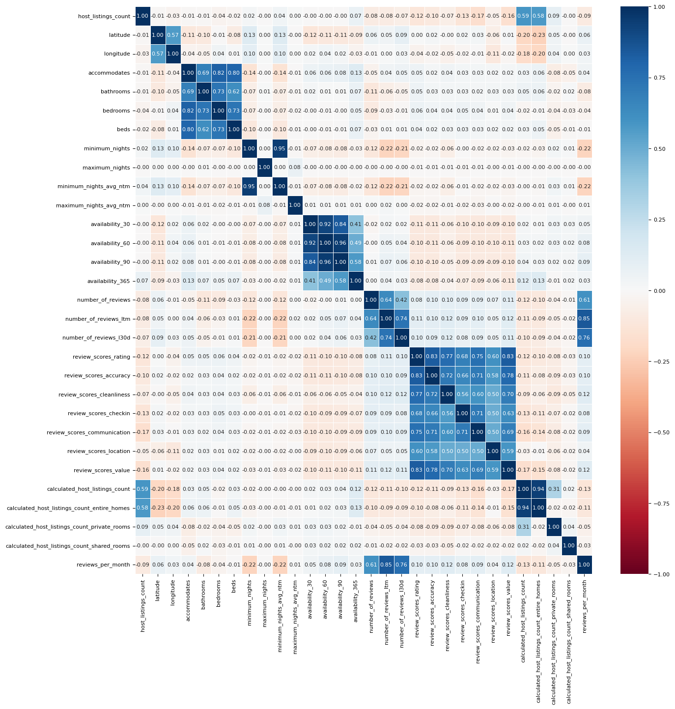

Now, our data appears more tangible, and relationships become more clear. For instance, closer to the middle of the heatmap, we see a 3x3 and a 4x4 square of high correlation features. The 3x3 square shows the correlation between the `number_of_reviews`, `number_of_reviews_ltm` (ltm stands for Last Twelve Months), and `number_of_reviews_l30d` (l30d stands for Last 30 Days) features. It makes sense why these would be highly correlated as `number_of_reviews` is a super set of `number_of_reviews_ltm` which is a superset of `number_of_reviews_l30d`.

Now, in the top left quadrant of the heatmap, we see two 2x2 squares and one 4x4 square of high correlation features. The relatively highly correlated 2x2 square which contains the `latitude` and `longitude` features makes sense since we are looking at only listings in the United States and there are areas in the US that are highly population dense relative to the other areas. The other 2x2 square of highly correlated data contains the `host_listings_count` and `host_total_listings_count` features which would make sense since in the data dictionary both of these features contain the exact same description.

The high correlation between `latitude` and `longitude` is interesting, so we decide to plot the location of all the listings:

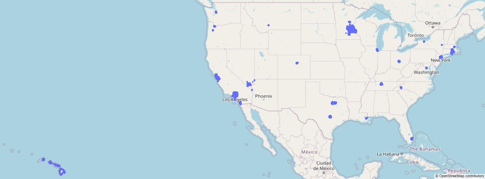

Indeed, listings are prevalent around populous areas - such as New York or Los Angeles - and tourist areas - such as Hawaii.

> This high level overview helps us appreciate the scale and complexity of our data, but we need to go deeper to find what features might be useful for the model.

#### Numeric Feature Visualizations
[Back to table of contents](#table-of-contents)

As there are too many features, we only discuss the most interesting ones here. For a more detailed description, see [here](eda/eda.ipynb).

We start by looking at the distribution of all the review scores:

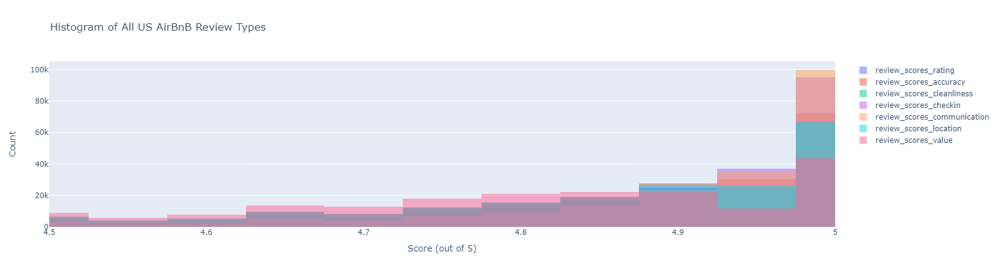

The values actually range from 0 to 5, but we zoom in on this region as >90% of the values are here. Clearly, all of the review scores are very similar. Thus, moving foward, **we will use `review_scores_rating`, the average of all other review features, as our model's target variable.**

One feature we might think is correlated to rating is price:

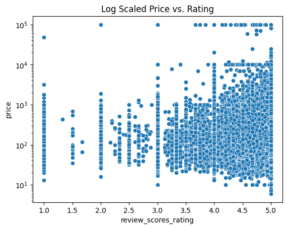

It appears that price increases as the ratings go up, with many exceptions. There does not seem to be any general trend though, except that there are vertical lines where the ratings are integer values - this is probably from all the listings with very small reviews. Even in these lines there is not general relationship it appears.

> In brief, there does not appear to be a single numerical feature with a clear-cut linear or polynomial relationship with review scores. So we turn our EDA to exploring non-numerical columns.

#### Non-Numeric Feature Visualizations
[Back to table of contents](#table-of-contents)

One idea is that a host's age on the platform would overall mean higher ratings (from experience):

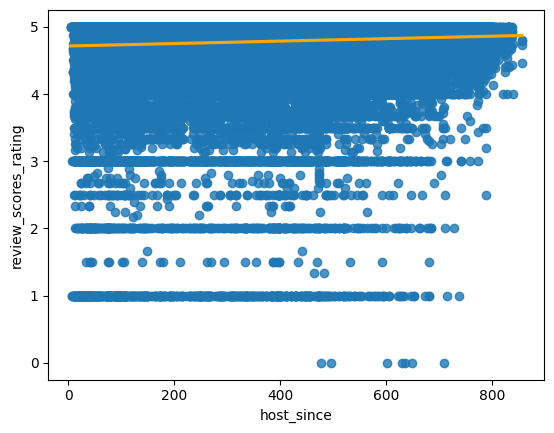

In the above graph, the number of weeks that a host has been on the platform is on the x-axis versus the `review_scores_rating` feature on the y-axis. We can see a small, but not insignificant, positive correlation between the two, which indicates that the longer a host has been on the platform, the higher their review rating tends to be, but nothing high correlation.

As an aside, it is interesting to see when US hosts signed up for AirBnb:

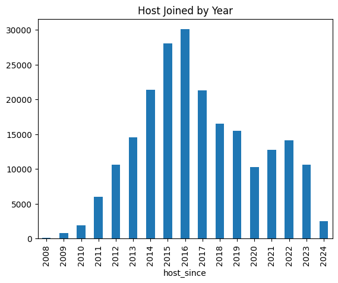

Indeed, our initial guess that AirBnb spiked in popularity due to the pandemic appears to be correct. That is, the platform started to see a surge in the number of hosts signing up at the time, though not as great as the company's boom in 2015.

Going back to the model, we seek to explore how other non-numerical data relate to review scores. Since many of these features ended up in our final model, we discuss them in the preprocessing section below.

### Preprocessing
[Back to table of contents](#table-of-contents)

Our dataset contains many text-columns, which we approached by counting the most prevalent words of, and comparing their prevalence amongst all listings versus listings with 4.9+ rating at least 100 reviews, which we arbitrarily define as **popular listings**.

For example, this approach yields us the following visualization for words in the listing description:

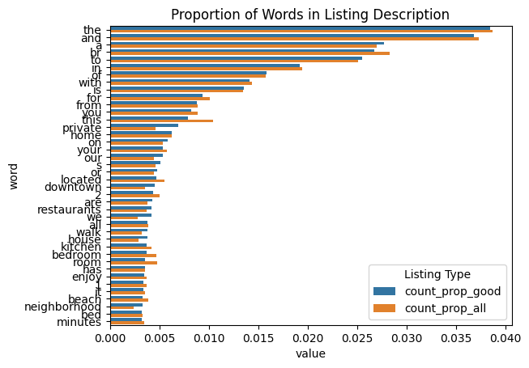

We decided to take all the non-filler words, and encode a feature whose value is the number of times these keywords appeared in a listing:

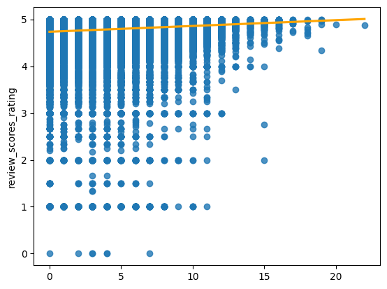

Indeed, this looks like a promising feature, as there is a clear positive slope, and listings with many values are exceedingly rare. Continuing our feature engineering in this direction, we find that this sort of "word counting" trick works for all the text-based features.

There is one last feature worth mentioning in our feature engineering process: `amenities`. Amenities is a list of host-reported amenities from 'Jacuzzi' to 'Suave Shampoo'. Interestingly, taking the length of this list makes for a pretty good feature:

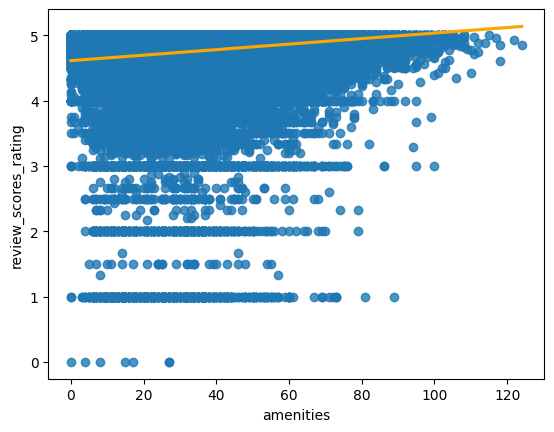

#### Missingness and Imputation
[Back to table of contents](#table-of-contents)

The last step of the preprocessing was to determine what exactly we should do with observations that had missing data. This is actually quite the concern:

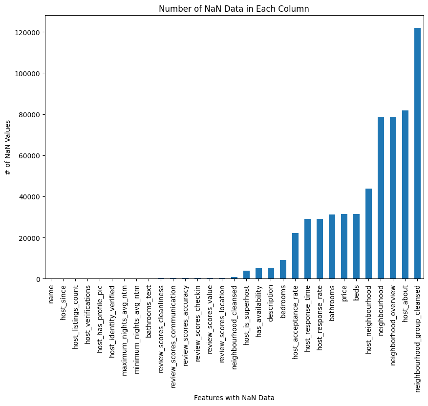

For features that were numerical, we decided to take the mean of that feature across all observations and use that to replace the missing data. For categorical, it was a bit trickier. We initially thought that we would take the median observation and replace the missing data with it. But we decided against it since we might be introducing something that a listing did not have originally. 

For example, the amenities feature is a list of amenities that consist of all amenities a listing provides. If we took the most appeared amenity and used it to replace a `NaN` for a listing, that may or may not even have this amenity, we are essentially adding bias. So we decided to simply ignore this feature if a listing is missing it.

Thus, our preprocessing can be summarized using the following preprocessing `sklearn` `pipeline`:

```python
preproc = make_column_transformer(
    (SubstringsTransformer(names_meaningful), 'name'),
    (SubstringsTransformer(desc_meaningful), 'description'),
    (WeekTransformer(), 'host_since'),
    (LengthTransformer(), 'host_verifications'),
    (OneHotEncoder(handle_unknown='ignore'), ['property_type']),
    (OneHotEncoder(handle_unknown='ignore'), ['room_type']),
    (LengthTransformer(), 'amenities'),
    (StandardScaler(), numeric_features)
)
```

As you can see, `amenities` is not the only column that gets a special kind of transformer. For more details, see our [model.ipynb](model/model.ipynb). We list down some of the more interesting ones not mentioned above:

- `Host Verifications`: The column `host_verifications` tells the user which method of communication of the host is vertified. To work with this feature, we decided to encode the length of all the list, since it would be difficult to determine whether it is more valuable to have one type of verification than the other, but it is relatively sensible that more verifications imply a more communicative host. We then plotted a regression plot and based on the graph, and we observed that the relationship between `host_vertifications` and `review_scores_rating` is pretty flat, indicating that `host_vertification` has a weak correlation to `review_scores_rating`, making it a unreliable feature. Hence we are dropping it i.e. not using it in our model. This makes sense, since someone is unlikely to rate a listing higher just because say the host is accesible through two email adresses instead of one.

- `Property Type`: When it comes to the `property_type` feature, we trained a linear regression model using only this feature and when we look at the `r^2 score` for our model, we get 0.02993098364575919. The `r^2 score` can be seen as a continuous value in the interval [0, 1] which indicates how good this feature is at helping our model predict the reivew rating for a listing where 0 means bad and 1 means good. The score we got isn't good but its not like this feature is insignificant either. This is significant, as there are 125 different property types, so including a `OneHotEncoding()` of this feature will introduce 125 new features!

- `Host Response Time` and `Rate`: For `host_response_time`, as we did with `room_type` and `property_type`, we used this feature to train a linear regression model and then got an `r^2 score`, this time of 0.002128186367516438. Similar to `room_type` this is a very low `r^2 score` which indicates to us that this feature is not very relevant in our model's prediction of a listing's review rating, thus we are not going to be using this feature. This makes sense - there are only four classes of values in this column: within an hour, few hours, a day, and a few days. These tell us almost nothing. For example, a listing that is only popular in the summer may have a host that responds quickly in the summer, but does not even open AirBnb in the winter - such hosts may have a response time of a few days or more despite delivering highly rated listings. Thus, this is an example of a feature that did not make the cut for our model.

- `Host Profile Pic`: For `host_profile_pic`, as we did with `room_type`, `property_type`, and `host_response_time`, we used this feature to train our model and then got an `r^2 score`, this time of 0.0006544772136575228. Similar to `room_type` this is a very low `r^2 score` which indicates to us that this feature is not very relevant in our model's prediction, probably because around 90% of hosts have a profile picture. As a remark, this makes hosts without any profile picture particularly shady!

> Hence, with a ludicrous 217,000 rows and 159 features, we are ready to train some models!

### Model 1
[Back to table of contents](#table-of-contents)

For our first model, we chose Linear Regression for reasons explained in the Discussion section. Linear Regression does not take any hyperparameters besides the features engineered in our preprocessing section above. Thus, the model implementation is very straightforward:

```python
model = make_pipeline(
    preproc, 
    SimpleImputer(strategy='mean'),
    LinearRegression()
)
```

We then do a 10-fold cross validation using the following code:
```python
X = df.drop(columns=review_cols)
y = df['review_scores_rating']

scores = {}

kf = KFold(n_splits=10, shuffle=True, random_state=42)
for i, (train_index, test_index) in enumerate(kf.split(X)):

    X_train_fold, X_test_fold = X.iloc[train_index], X.iloc[test_index]
    y_train_fold, y_test_fold = y.iloc[train_index], y.iloc[test_index]

    model.fit(X_train_fold, y_train_fold)
    y_train_pred_fold = model.predict(X_train_fold)
    y_test_pred_fold = model.predict(X_test_fold)
    
    scores[i] = {}
    scores[i]['train'] = {
        'mean_squared_error': mean_squared_error(y_train_fold, y_train_pred_fold),
        'mean_absolute_error': mean_absolute_error(y_train_fold, y_train_pred_fold),
        'r2_score': r2_score(y_train_fold, y_train_pred_fold)
    }
    scores[i]['test'] = {
        'mean_squared_error': mean_squared_error(y_test_fold, y_test_pred_fold),
        'mean_absolute_error': mean_absolute_error(y_test_fold, y_test_pred_fold),
        'r2_score': r2_score(y_test_fold, y_test_pred_fold)
    }
```

### Model 2
[Back to table of contents](#table-of-contents)

For our second model, we opted for a Sequential Neural Network featuring `LeakyRelu` activation filters. To choose the hyperparameters, we conducted three grid searches, the first two to reduce the size of the problem space for the third one.

First, we searched through every possible `keras` optimizer and learning `rate` order of magnitude:

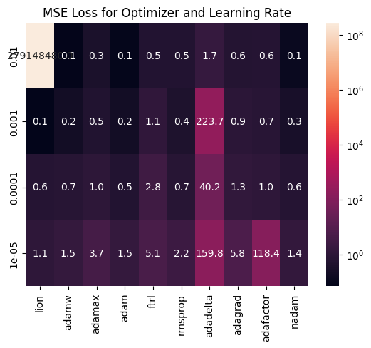

Clearly, `Lion`, `Adam`/`AdamW`, and `Nadam` have the best, smallest, and most consistent losses, so these are what will move on to our hyperparamter tuning stage. We then see how the number of layers and nodes per layer affect our MSE loss:

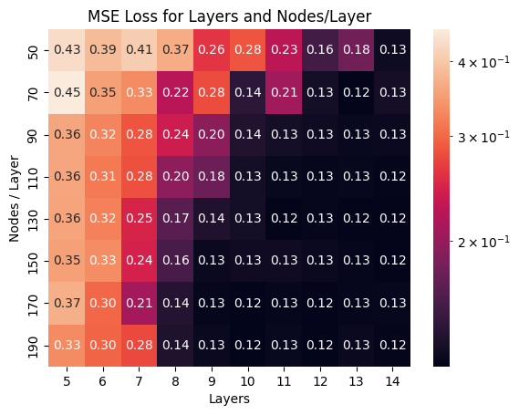

Here, we see how our model's training loss decreases as we add more layers and more nodes. This is consistent with the fitting graph - as we add more layers or nodes, we increase model complexity, and run the risk of overfitting our training data. This means we need to hyperparameter tune in the region between `8-11` layers and `90-130` nodes, since this is when the loss starts to go down, without it being too high that we run the risk of overfitting.

Thus, we have the following hyperparamters left to tune:
- Optimizer: `AdamW`, `Nadam`, or `Lion`
- Learning Rate: `0.00001` - `0.0001`
- Layers: `8`-`11`
- Nodes/layer: `90-130`
- Activation Function: `relu`,`sigmoid`,`tanh` (for hidden layers)

Thus, let's define a Keras Tuner to automatically report the best combination. We remark that code will not take an unfathomable number of resources since we had already dramatically limited the problem scope in the previous two sections.

```python
import keras_tuner as kt
hp = kt.HyperParameters()

def build_hp_NN(hp):
    model = Sequential()
    model.add(Input(shape=(X_features.shape[1],)))

    num_layers = hp.Int('num_layers', min_value=8, max_value=11)
    for _ in range(num_layers):
        model.add(Dense(
            hp.Int('num_nodes', min_value=90, max_value=130, step=10),
            activation=hp.Choice('activation_func', ['relu','sigmoid','tanh'])
        ))
        model.add(LeakyReLU(negative_slope=0.01))

    model.add(Dense(1))

    optimizer_dict = {'lion': Lion, 'adamw': AdamW, 'nadam': Nadam}
    optimizer_class = optimizer_dict[hp.Choice('optimizer_class', ['lion','adamw','nadam'])]
    learning_rate = hp.Float('learning_rate', min_value=1e-5, max_value=1e-3, sampling="log")
    model.compile(
        optimizer=optimizer_class(learning_rate=learning_rate),
        loss='mean_squared_error',
        metrics=['mean_squared_error','val_mean_squared_error']
    )
    return model
```

The best hyperparameters are as follows:
| Hyperparamter   | Best Value            |
|-----------------|-----------------------|
| num_layers      | 9                     |
| num_nodes       | 110                   |
| activation_func | sigmoid               |
| optimizer_class | lion                  |
| learning_rate   | 5.449514749224714e-05 |

We thus implement the final tuned NN with the folllowing code:

```python
def make_best_NN():
    """Returns best NN based on hyperparameter tuning."""
    model = Sequential()
    model.add(Input(shape=(X_features.shape[1],)))

    for _ in range(9):
        model.add(Dense(110,activation='sigmoid'))
        model.add(LeakyReLU(negative_slope=0.01))

    model.add(Dense(1))

    model.compile(
        optimizer=Lion(learning_rate=5.449514749224714e-05),
        loss='mean_squared_error'
    )
    return model
```

We then run 10-fold cross validation to evaluate the model:

```python
scores2 = {}
X_copy = X_features
y_copy = y

kf = KFold(n_splits=10, shuffle=True, random_state=42)
for i, (train_index, test_index) in enumerate(kf.split(X_copy)):

    X_train_fold, X_test_fold = X_copy[train_index], X_copy[test_index]
    y_train_fold, y_test_fold = y_copy.iloc[train_index], y_copy.iloc[test_index]

    model = make_best_NN()

    model.fit(X_train_fold, y_train_fold,epochs=50,verbose=0)
    y_train_pred_fold = model.predict(X_train_fold,verbose=0)
    y_test_pred_fold = model.predict(X_test_fold,verbose=0)
    
    scores2[i] = {}
    scores2[i]['train'] = {
        'mean_squared_error': mean_squared_error(y_train_fold, y_train_pred_fold),
        'mean_absolute_error': mean_absolute_error(y_train_fold, y_train_pred_fold),
        'r2_score': r2_score(y_train_fold, y_train_pred_fold)
    }
    scores2[i]['test'] = {
        'mean_squared_error': mean_squared_error(y_test_fold, y_test_pred_fold),
        'mean_absolute_error': mean_absolute_error(y_test_fold, y_test_pred_fold),
        'r2_score': r2_score(y_test_fold, y_test_pred_fold)
    }
```

Now that we have implemented our models, we report the results of our 10-fold validations.

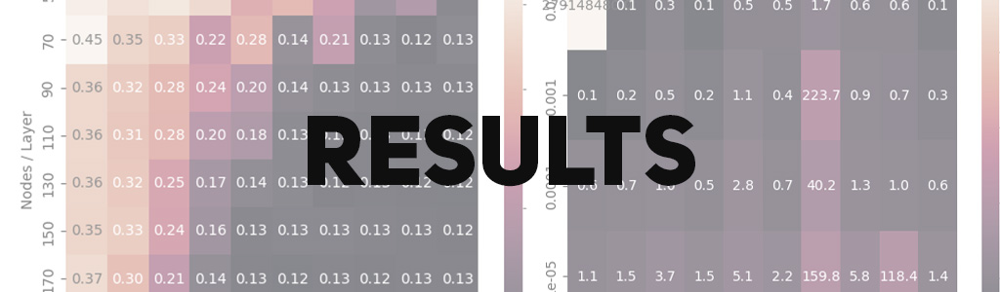
## Results
[Back to table of contents](#table-of-contents)

Note: An in-depth discussion of these results and potential improvements can be found in the [Discussion Section](#discussion).

### Model 1
[Back to table of contents](#table-of-contents)

We do 10-fold cross validation and report the metrics for each fold on our Linear Regression model.

|              |   mean_squared_error |   mean_absolute_error |   r2_score |
|:-------------|---------------------:|----------------------:|-----------:|
| (0, 'train') |             0.12613  |              0.198191 |  0.0879473 |
| (0, 'test')  |             0.130564 |              0.20048  |  0.08552   |
| (1, 'train') |             0.127414 |              0.199016 |  0.0872061 |
| (1, 'test')  |             0.118979 |              0.195752 |  0.0924823 |
| (2, 'train') |             0.126681 |              0.198671 |  0.0875633 |
| (2, 'test')  |             0.125549 |              0.19663  |  0.0893076 |
| (3, 'train') |             0.127029 |              0.198596 |  0.0875516 |
| (3, 'test')  |             0.123754 |              0.197797 |  0.0795305 |
| (4, 'train') |             0.126899 |              0.198766 |  0.0880649 |
| (4, 'test')  |             0.123835 |              0.196832 |  0.0828053 |
| (5, 'train') |             0.12554  |              0.197758 |  0.0881043 |
| (5, 'test')  |             0.135944 |              0.203179 |  0.0836539 |
| (6, 'train') |             0.126947 |              0.198569 |  0.0878757 |
| (6, 'test')  |             0.123132 |              0.198147 |  0.0866351 |
| (7, 'train') |             0.126227 |              0.198311 |  0.0874304 |
| (7, 'test')  |             0.129676 |              0.198832 |  0.0900592 |
| (8, 'train') |             0.126344 |              0.198277 |  0.0879102 |
| (8, 'test')  |             0.128622 |              0.199914 |  0.0859053 |
| (9, 'train') |             0.126359 |              0.198572 |  0.0884995 |
| (9, 'test')  |             0.128394 |              0.198563 |  0.0812679 |

We summarize it by taking the averages below:

|       |   mean_squared_error |   mean_absolute_error |   r2_score |
|:------|---------------------:|----------------------:|-----------:|
| test  |             0.126845 |              0.198613 |  0.0857167 |
| train |             0.126557 |              0.198473 |  0.0878153 |

We also attach the average differences between each metric between train and test:

|       |   mean_squared_error |   mean_absolute_error |   r2_score |
|-------|----------------------|-----------------------|------------|
| difference | -0.000288 | -0.000140 | 0.002099 |

### Model 2
[Back to table of contents](#table-of-contents)

We do 10-fold cross validation and report the metrics for each fold on our Sequential Neural Network model.

|              |   mean_squared_error |   mean_absolute_error |   r2_score |
|--------------|----------------------|-----------------------|------------|
| (0, 'train') |            0.100324  |              0.166675 |  0.187977  |
| (0, 'test')  |            0.130965  |              0.177124 |  0.0920074 |
| (1, 'train') |            0.101551  |              0.179577 |  0.196185  |
| (1, 'test')  |            0.101345  |              0.179156 |  0.149704  |
| (2, 'train') |            0.100578  |              0.175928 |  0.200441  |
| (2, 'test')  |            0.107871  |              0.177049 |  0.130703  |
| (3, 'train') |            0.102913  |              0.18821  |  0.192934  |
| (3, 'test')  |            0.100765  |              0.191031 |  0.0704145 |
| (4, 'train') |            0.103356  |              0.182372 |  0.185835  |
| (4, 'test')  |            0.103187  |              0.184251 |  0.092417  |
| (5, 'train') |            0.102092  |              0.182962 |  0.207228  |
| (5, 'test')  |            0.0919273 |              0.18137  |  0.0514895 |
| (6, 'train') |            0.0991111 |              0.170512 |  0.187944  |
| (6, 'test')  |            0.138846  |              0.182306 |  0.119488  |
| (7, 'train') |            0.100006  |              0.174586 |  0.187665  |
| (7, 'test')  |            0.121794  |              0.185548 |  0.177905  |
| (8, 'train') |            0.103255  |              0.172554 |  0.187263  |
| (8, 'test')  |            0.0966669 |              0.172099 |  0.143063  |
| (9, 'train') |            0.0995553 |              0.173294 |  0.204133  |
| (9, 'test')  |            0.122812  |              0.188462 |  0.057875  |

We summarize it by taking the averages below:

|       |   mean_squared_error |   mean_absolute_error |   r2_score |
|-------|----------------------|-----------------------|------------|
| test  |             0.111618 |              0.18184  |   0.108507 |
| train |             0.101274 |              0.176667 |   0.19376  |

We also attach the average differences between each metric between train and test:

|       |   mean_squared_error |   mean_absolute_error |   r2_score |
|-------|----------------------|-----------------------|------------|
| difference | -0.010344 | -0.005172 | 0.085254 |

This concludes our results.

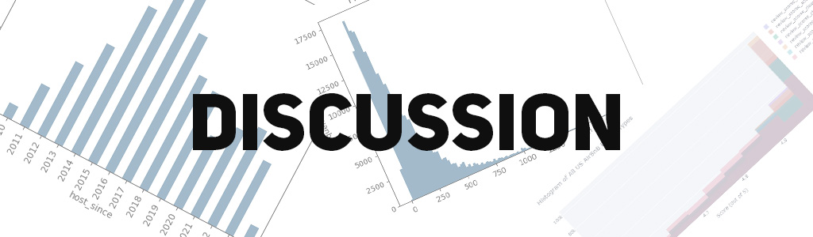
## Discussion
[Back to table of contents](#table-of-contents)

We split the discussion into three subsections for each model:
1. General Metric Discussion
2. Model on Fitting Graph
3. Improvements and Next Steps

### Model 1
[Back to table of contents](#table-of-contents)

We start by motivating why we start with linear regression. Linear regression is a hyperparameterless model - besides feature engineering. This means the model has 3 main benefits:

1. It is relatively simple, and features almost entirely dictate how well the model performs. This allows us to focus on enginnering good, relevant features for our second, more complicated model.
2. LinearRegression allows us to check the coefficient of every variable, and when standardized or normalized, a sense of which features play the largest role in determining the review score.
3. It is extremely fast and easy to implement LinearRegression, allowing us to test many different features and encodings quickly.

#### General Metric Discussion
[Back to table of contents](#table-of-contents)

Our `mean absolute error` for our linear regression was `0.19` for both the train and test prediction. The similarity between these values tell us that our model has not overfitted, but the large values (considering review ratings go from 0 to 5 only) show us that the model is not very good. Same can be said for `mean squared error` which was `0.12`. 

The `r2_score` however tells a very interesting story. The `r2_score` is a correlation metric that goes from 0 to 1, where 0 implies no correlation and 1 is identical correlation. Our low value of `0.08` tells us that despite the large number of features, we still have not effectively represented the data. 

In conclusion, our first model did not perform very well. Our data is too sporadic and that attempting to fit a simple line on data that is complex is fruitless no matter how often we optimize our coefficients (which is the only way we can optimize in linear regression), scaling a line would only result in a line. 

#### Model on Fitting Graph
[Back to table of contents](#table-of-contents)

Since our `MSE` is high, and since the complexity of linear regression is very low, we are simply underfitting our data. Again, we are attempting to fit a line on data that is sparse and not very linear. Based on our relatively high `MSE`, and generally almost identical test and train `MSE`, `MAE`, and `r2`, it is safe to say that our model is not that far along the fitting graph. In other words, our model has not overfitted the data since we see very similar values between the test and train metrics. This is very good for us, as there is much room to add more model complexity - such as by adding more features, or changing to a more complex model - and improve the metrics in our second, better model.

#### Coefficient Analysis
[Back to table of contents](#table-of-contents)

Recall that one of the main reasons we chose Linear Regression for our first model is the ability to compare the significance of various features to the regression. We summarize the values of the absolute values of our coefficients:

| Description of Coefficients | Value |
|-|-|
count   | 159.000000
mean    |  0.021966
std     |   0.028256
min     |   0.000027
25%     |   0.004170
50%     |   0.009904
75%     |   0.030899
max     |   0.153812

We notice the average value is 0.021, meaning our columns do have an impact on the review score to the 0.01 order of magnitude. Here are the top 10 features (as indexes) and their coefficients:

154    0.153812
63     0.130499
86     0.126531
155    0.116383
90     0.112651
93     0.103163
88     0.096587
130    0.076349
87     0.075408
101    0.067546

In order to do more in-depth coefficient analysis, we need to look at what each column actually represents. Using our pipeline, we list down the columns:

- 1 substring feature (from `name`)
- 1 substing feature (from `description`)
- 1 week feature (from `host_since`)
- 1 length feature (from `host_verifications`)
- 125 one-hot encoded features (from `property_type`)
- 4 one-hot encoded features (from `room_type`)
- 1 length feature (from `amenities`)
- 25 numeric features (as listed in `numeric_features`)

We discuss the top ten features below:

- Feature 154 (`calculated_host_listings_count`):
It makes quite a lot of intuitive sense why this feature would be the most impactful, the more reviews a host has, the more likely it is that one of their listings is going to be a high rating listing. The longer a host is on the platform, the more time they have to accumulate reviews. This is definitely a feature that we could try to feature engineer further to give our model more to work with.

- Feature 155 (`number_of_reviews_l30d`):
The number of reviews a listing has in the last 30 days seems to have played quite a significant role in the model's predictions. This makes sense as, similar to calculated_host_listings_count, the more reviews a listing has in the last 30 days, the more likely that listing is to have a good rating since people wouldn't want to keep booking and reviewing a place that is poorly rated.

- Feature 130 (`some room_type`):
We see that there is a room type that reigns supreme over all of the other room types. This would make sense as AirBnB is a service that offers practical temporary housing, so people who just need a quick place to recharge and rest are in need of a specific kind of room rather than the other possible room types.

- Feature 63, 86, 90, 93, 88, 87, 101 (some `property_types`):
These features are part of our one hot encoded feature property_type, so we know that there are specific property types that are weighted very heavily. This, once again, makes a lot of sense since most users are only going ot be in search of a handful of different property types, rather than there being a uniform distribution over the 125 property types.

#### Improvements and Next Steps
[Back to table of contents](#table-of-contents)

Here are some ways in which we may be able to improve our model:
- Increasing the number of features
- Better feature engineering
- Trying different complexity models such as polynomial regression or neural networks
- We could try using coalesced features.

Since our mean squared error of our first model being linear regression is not exactly ideal, we decided that the next potential model we can train and test would be a neural network. Since the fit of the linear regression line is producing a unoptimal mean squared error, we believe that a simple linear best fitting line is simply not good enough to fit our supposedly complex data. By using a neural network and messing around with the amount of neurons per hidden layer, the amount of hidden layers, and the many activation functions, we add more depth and complexity in hopes of finding the best fit that captures the relationship between our features while in turn producing a fairly accurate prediction.

### Model 2
[Back to table of contents](#table-of-contents)

Our first model has taught us a few things:
- We need to dramatically increase model complexity.
- There is no "magic feature" that is extremely correlated with review scores.
- Many of our features have only a small number of possible numerical values.

As such, a neural network comes to mind for our second model. Here are three reasons why a neural network appears to be the next best step:

1. The data and features are extremely complicated, so simple kernels like linear or polynomial transformations is insufficeint to describe a feature's relationship with the review scores. By using a neural network, we gain access to the use of activation functions, allowing us to add non-linearity and complexity to our model to better fit our data. 
2. We have an incredible number of features (159), and NNs excel at finding general patterns from a large number of features and combining them together (this means we will need a lot of layers with a lot of nodes each).
3. The data is extremely large, meaning that there is much room for our model to explore the data before it overfits. This reduces the high complexity downside of NNs.

#### Hyperparamter Tuning

Before discussing the results, we remark that through `100` trials of hyperparameter tuning which took hours, it concluded that the most optimal neurons per layer is `110`, optimal hidden layer is `9`, optimal activation function is `sigmoid`, and optimal learning rate is `5.449514749224714e-05`. We ended up with a mean squared error of 0.09 - an improvement over our linear regression model. More details can be found in our [Methods section](#methods).

#### General Metric Description
[Back to table of contents](#table-of-contents)

We start with the `mean_absolute_error`, which tells us that on average our predicted rating is about `0.17` off for both the test and train cases. The similarity between these values tell us that our model has not overfitted, and though the values are a noticeable improvement compared to our first model, it is not ideal either. This shows how complex predicting review scores is.

Same can be said for our `mean_squared_error`. We note that its value is smaller than the `mean_absolute_error` being average `0.10`, which makes sense as it is roughly the square root of the `mean_absolute_error`.

The `r2_score` however tells a very interesting story. The `r2_score` is a correlation metric that goes from 0 to 1, where 0 implies no correlation and 1 is identical correlation. Our value of `0.19` for train and `0.10` for test shows that our data is right on the edge of the fitting graph, meaning it is right under from overfitting. This is a marked improvement to our linear regression `r^2` of about `0.8`, meaning our second model is a definite improvement.

#### Model on Fitting Graph
[Back to table of contents](#table-of-contents)

Based on the similarity of our `MSE` and `MAE`, we know that our model has not overfitted the training data. However, the large difference between `r2_scores` tells us that our model is much father along - or more complex - than our linear regression model on the fitting graph. In other words, adding more layer or complexity may run the risk of overfitting, though we are clearly not there yet. This is very good for us, since it means that our model is quite generalizable (as the 10 folds contain similar values), but also quite difficult as adding large amounts of complexity is likely going to cause us to overfit our data.

#### Improvements and Next Steps
[Back to table of contents](#table-of-contents)

Compared to our first model, the second model has much higher model complexity, and there is evidence (as discusses in the r2_scores above) that we are approaching the overfitting mark, though we are not there yet. This leaves us at a rather difficult stalemate: We have engineered a lot of features, have a large amount of data, and high model complexity, with optimized hyperparameters and a very small learning rate. This means that any potential model improvements probably needs to involve a major change in how we do our model.

Here are some ways in which we may be able to improve our model:
- Changing the type of NN layers. Right now, we have a "default" NN with backpropagation and only Dense layers with LeakyRelu in between. Perhaps trying different more complicated layers such as convolution or pooling layers may better bring out the correlations in the data.
- Changing the type of activation function dynamically. Mathematically, each activation function is ideal for a very specific type of identification. Perhaps changing activation functions between layers may help bring out the patterns in the data.
- Doing more feature engineering. Some features, such as amenities, are only explored by length. Though it can be argued that there isn't much for us to do here, (since how much does amenities, for example, really impact the reviews of a listing?), it also means we have not tapped into this data's full potential. However, a full NLP stack will be necessary for this, which comes with concerns of overfitting and bias.

## Conclusion
[Back to table of contents](#table-of-contents)

In this project, we trained two models: First a linear regression model, which prompted us engineer features for categorical columns, and second a neural network, which gave us the model complexity and the ability to hyperparameter tune, allowing us to improve our metrics. Though our best model (the tuned NN) has an MSE of 0.1, MAE of 0.1, and r2 of 0.2, which is not ideal roughly speaking, this is already quite good in the grand scheme of things. 

In other words, our purpose of providing more information to AirBnB customers for what things to look out for a highly rated (i.e. enjoyable) stay, and AirBnb hosts by what things to work on to deliver better rated experiences (i.e. more profitable listings) has largely been achieved by this model. For the customer, one can take a listing they really like, but say with 0 or very few reviews, and use the model to heuristically predict whether this listing has the characteristics and potential to be a good stay. To the host, one can take a couple new listings and predict roughly whether one will do better than the other in terms of review scores. This may also allow hosts to tune their descriptions, pricing, etc and predict how these things will impact the review rating of their listing.

Thus, we conclude that given our metrics, being able to predict a given listing's review score plus minus 0.1 stars is more than enough precision to provide meaningful insights to both parties, and thus the project is largely a success. We note however, that based on personal experiences, that a 0.1 rating difference can be quite substantial, espeically when so many choices is presented to the customer by AirBnb.

## Statement of Collaboration
[Back to table of contents](#table-of-contents)

Our group participated in a lot of collaboration. Rather than having super clear cut roles, we divvied up the work and did what was expected of us while getting constant feedback from the other group members. *This means that while the general descriptions of what we did can be seen below (This is not an exhaustive list), we were all very involved with the other group member's work as well, which means each one of us got a holistic hands-on experience with the entire project and had even participation throughout the whole project. Overall, we were all very involved in the project, and constantly communicated with eachother.*

Ryan Batubara: Feature Engineering, Plotting and Graphing, Report Writing, Model tuning, README, Model Design, Exploratory Data Analysis (Plotting), etc.

Artur Rodrigues: Feature Engineering, Explanations for Plots and Graphs, Report Writing, Banners, Exploratory Data Analysis (Descriptions), etc.

Doanh Nguyen: Feature Engineering, Explanations for Plots and Graphs, Report Writing (Major Role), Exploratory Data Analysis (Descriptions), etc.

Thank you for reading our project report.
[Back to table of contents](#table-of-contents)