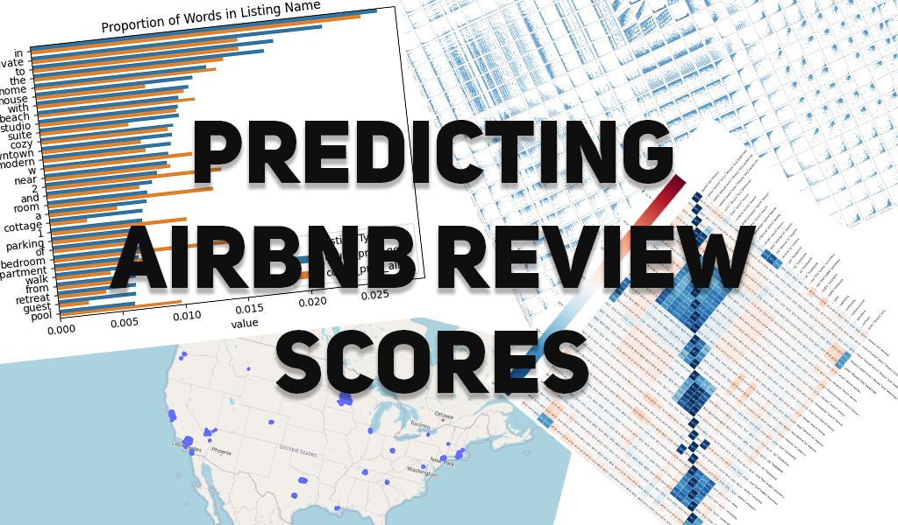

# Predicting AirBnB Review Scores

Names:
- Artur Rodrigues, arodrigues (at) ucsd (dot) edu 
- Doanh Nguyen, don012 (at) ucsd (dot) edu 
- Ryan Batubara, rbatubara (at) ucsd (dot) edu

## Abstract

With the end of the Covid 19 pandemic, there has been a huge boom in travel and entertainment industries worldwide. With the pandemic still in the minds of many people, travelers may tend to seek more private and personal accommodations such as those on AirBnB. Here, we predict the review score (on a scale of 0 to 100) of an AirBnB posting based on various features, like amenities available, number of reviews, price, and others. The intention is that this may provide AirBnB hosts better insight into what makes a highly rated AirBnB experience.

## Dataset

This project will be based on data gathered by [Inside AirBnb](https://insideairbnb.com/get-the-data/) May to June 2024. To keep our analysis more focused, we will only be analyzing AirBnB listings from the United States. Since Inside AirBnB only offers datasets per city, we have downloaded all US cities with AirBnB listings and combined them into one csv file. Due to the size of this file, [Inside AirBnB reposting policies](https://insideairbnb.com/data-policies/), and [Github Data storage policies](https://docs.github.com/en/repositories/working-with-files/managing-large-files/about-storage-and-bandwidth-usage), we will not be uploading this combined file to the repository. That said, the combined dataset is available [here](https://drive.google.com/file/d/1DwNaHBBgTesytLoGn23QZMURfK41Du2K/view?usp=sharing), but requires a UCSD account.

A data dictionary for the data can be found at [Inside AirBnB's data dictionary](https://docs.google.com/spreadsheets/d/1iWCNJcSutYqpULSQHlNyGInUvHg2BoUGoNRIGa6Szc4/edit?gid=1322284596#gid=1322284596).

## Data Preprocessing

Our data preprocessing can be split into three steps:

### Dropping Unecessary Columns

Some columns in the original data are unecessary for our purposes. For a detailed description of each column, see the [Inside AirBnB Data Dictionary](https://docs.google.com/spreadsheets/d/1iWCNJcSutYqpULSQHlNyGInUvHg2BoUGoNRIGa6Szc4/edit?gid=1322284596#gid=1322284596).

We list reasons for dropping these columns:
- `All URL`: Unique elements for each listing. Does not contribute anything when predicting the review score.

- `All ID`: Unique elements for each listing. Does not contribute anything when predicting the review score.

- `host_name`: Indiviudally unique elements for each listing. Does not contribute anything when predicting the review score.

- `license`: Unique elements for each listing. Does not contribute anything when predicting the review score.

- `source`: Holds whether or not the listing was found via searching by city or if the listing was seen in a previous scrape. There is no logical
connection between this and the target variable, which is review score.

- `host_location`: Private information.

- `host_total_listings_count`: There exists another feature called `host_listings_count`, this is a duplicate feature.

- `calendar_last_scarped`: Holds the date of the last time the data was scrapped, no logical connection between this and predicting `review_score_rating`.

- `first & last review`: provides temporal data for the first & last review date. Last review date can be misleading as an unpopular listing may have no reviews for an extended amount of time, and suddenly get a review.

- `minimum_minimum_nights, maximum_minimum_nights, minimum_maximum_nights, maximum_maximum_nights`: The all time minimum and maximum of a listing's minimum and maximum nights requirement for booking. This has no correlation to review score because you cannot write a review if you have not stayed at the listing. A person who wants to book a listing for 10 days is not going to book a listing that has a maximum night stay of 9 days.

### Dropping 0 Review Listings

Since we are trying to predict AirBnB review scores (for the purpose of finding out what makes a good review score), we will be dropping all listings that have 0 reviews. This is because, from the perspective of our model, these rows do not provide any meaningful information into what makes a highly rated listing (since their review scores are `NaN`, and are missing by design).

We remark that this still leaves us with almost 200 thousand rows, so the data remains large enough for a model.

### Fixing Datatypes

Some columns have incorrect datatypes, such as:
- `host_response_rate` and `host_acceptance_rate` should be change from a `str` percent to a `float`.
- `host_is_superhost`, `host_has_profile_pic`, `host_identity_verified`, `has_availability`, `instant_bookable` should be booleans.
- `last_scraped` and `host_since` should be Pandas timestamps.
- `price` should be a float in dollars.
- `amenities` should be a list.

## Exploratory Data Analysis

This exploratory data analysis will be split into three parts:

- [General Data EDA](#general-data-eda), where we visualize general information about the dataset.
- [Numerical Data EDA](#numerical-data-eda), where we see how numerical features relate to predicting review scores.
- [Text and Categorical Data EDA](#text-and-categorical-eda), where we see how textual and categorical data may help our predictions.

You can see our EDA in the Jupyter notebook called `eda.ipynb` in the `eda` folder [here](./eda/eda.ipynb).